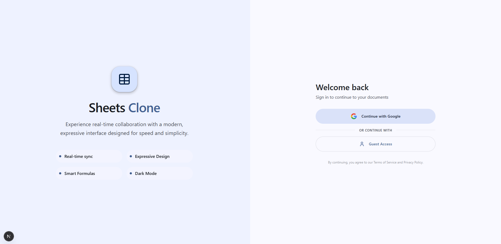
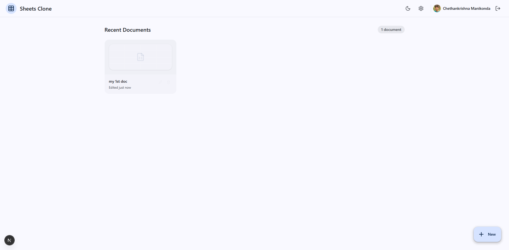
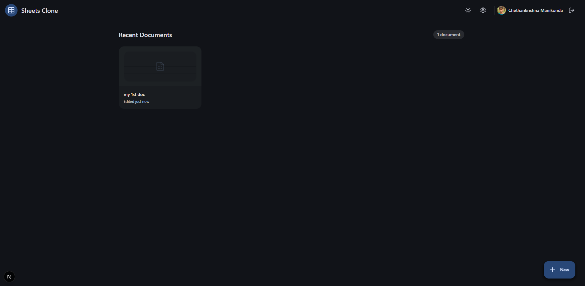
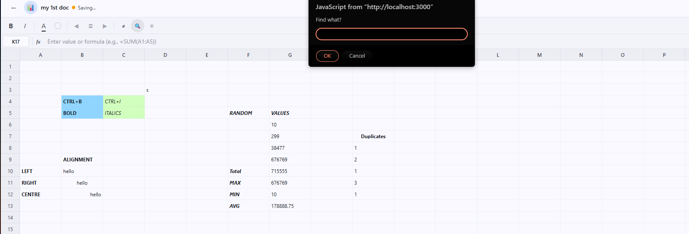
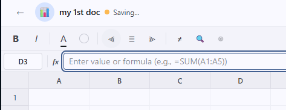
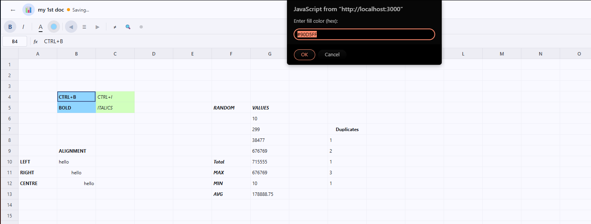
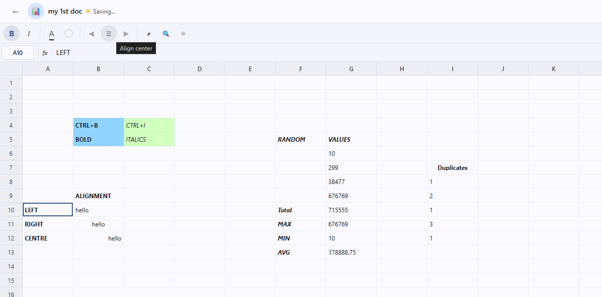
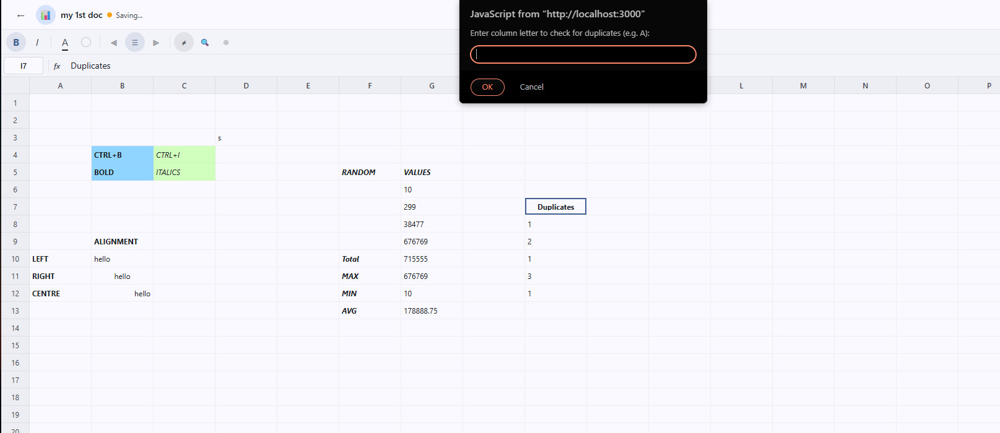

# Sheets Clone

A Google Sheets style web app built with Next.js 16, React 19, Tailwind CSS v4, and Firebase. It supports spreadsheet editing, formulas, real-time sync, formatting tools, selection ranges, column reordering, row and column resizing, duplicate cleanup, find and replace, and merged cells.

## Preview

### Login



### Dashboard





### Spreadsheet Features











## Features

- Virtualized spreadsheet grid for large datasets.
- Formula engine with support for `SUM`, `AVERAGE`, `COUNT`, `MIN`, `MAX`, `ABS`, `ROUND`, `IF`, `TRIM`, `UPPER`, and `LOWER`.
- Formula auto-detection when users type functions directly into cells.
- Rich formatting with bold, italic, text color, background color, and alignment.
- Drag-to-select ranges and merge cells.
- Column reordering plus row and column resizing.
- Find and replace across populated cells.
- Remove duplicates by column.
- Real-time collaboration and presence indicators using Firebase.
- Light and dark themes.

## Tech Stack

- Next.js 16 App Router
- React 19
- TypeScript
- Tailwind CSS v4
- Firebase Auth and Firestore
- @tanstack/react-virtual
- lucide-react
- motion

## Local Development

1. Clone the repository.
2. Install dependencies with `npm install`.
3. Create `.env.local` with your Firebase client config:

```env
NEXT_PUBLIC_FIREBASE_API_KEY=...
NEXT_PUBLIC_FIREBASE_AUTH_DOMAIN=...
NEXT_PUBLIC_FIREBASE_PROJECT_ID=...
NEXT_PUBLIC_FIREBASE_STORAGE_BUCKET=...
NEXT_PUBLIC_FIREBASE_MESSAGING_SENDER_ID=...
NEXT_PUBLIC_FIREBASE_APP_ID=...
NEXT_PUBLIC_FIREBASE_DATABASE_URL=...
```

4. Start the app with `npm run dev`.
5. Open `http://localhost:3000`.

## GitHub Pages

This repo is configured for GitHub Pages deployment through GitHub Actions. The static export is built from `next build`, and Pages will publish the generated `out` directory.

Note: the document route uses a query string on Pages-compatible builds, for example `.../doc/?id=<document-id>`.

Expected Pages URL for this repository:

`https://chethan616.github.io/Sheets-clone/`

Before the workflow can deploy successfully, add these GitHub repository secrets:

- `NEXT_PUBLIC_FIREBASE_API_KEY`
- `NEXT_PUBLIC_FIREBASE_AUTH_DOMAIN`
- `NEXT_PUBLIC_FIREBASE_PROJECT_ID`
- `NEXT_PUBLIC_FIREBASE_STORAGE_BUCKET`
- `NEXT_PUBLIC_FIREBASE_MESSAGING_SENDER_ID`
- `NEXT_PUBLIC_FIREBASE_APP_ID`
- `NEXT_PUBLIC_FIREBASE_DATABASE_URL`

Also make sure GitHub Pages is set to use GitHub Actions as the build and deployment source.

## Implementation Notes

- Virtualized grid: `src/components/editor/Grid.tsx`
- Editor state and spreadsheet actions: `src/components/editor/SpreadsheetEditor.tsx`
- Formula parser and evaluator: `src/lib/formula`
- Real-time document sync: `src/lib/firestore.ts` and `src/hooks`

Built for the Trademarkia Frontend Engineering Assignment.
